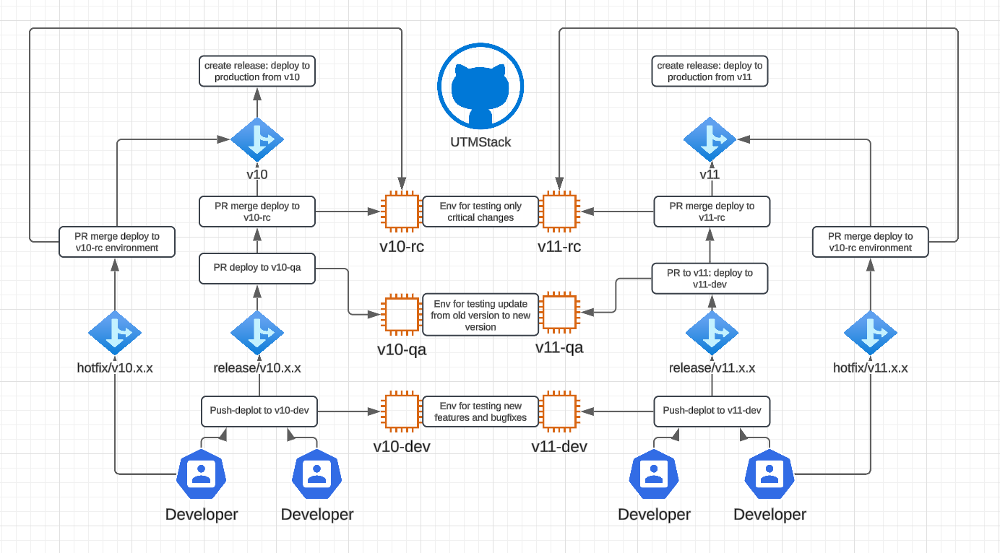

# 🛠️ Multi-Environment Workflows – UTMStack

> This repository uses a structured, version-based deployment system (`v10`, `v11`) across multiple environments: `dev`, `qa`, `rc`, and `prod`.  
> Each environment is triggered automatically based on branch patterns and workflow logic.



## 🌿 Branches Involved

- `v10`, `v11` → Main version branches  
- `release/v10.x.x`, `release/v11.x.x` → Feature/bugfix integration branches  
- `hotfix/v10.x.x`, `hotfix/v11.x.x` → For urgent production fixes  
- `feature/...` → Optional; features are typically integrated into `release/*` branches  

---

## ✨ Feature Flow (per version)

> Best used for planned feature development.

1. Developers work on shared integration branches:  
   `release/v10.x.x` or `release/v11.x.x`

2. On **push**, the `dev` workflow is triggered and deployed to:  
   `v10-dev` or `v11-dev`

3. Once stable, a **pull request is opened to `v10` or `v11`**, the `qa` workflow is triggered and deployed to:  
   `v10-qa` or `v11-qa`

5. After QA validation, the PR is **merged** into the base branch (`v10` or `v11`).

6. This triggers deployment to the **RC environment**:  
   `v10-rc` or `v11-rc`

7. Once RC validation is complete, a **release tag (`v10.x.x` or `v11.x.x`)** is created to deploy to production.

---

## 🔥 Hotfix Flow (urgent patches)

> Used for emergency fixes in production.

1. Create a branch:  
   `hotfix/v10.x.x` or `hotfix/v11.x.x` from `v10` or `v11`

2. After development, open a **PR to `v10` or `v11`**

3. On merge, the `rc` workflow is triggered:  
   `v10-rc` or `v11-rc`

4. If the patch is valid, create a **release tag** to deploy to production.

---

## ⚙️ GitHub Actions Triggers

| Environment | Trigger Condition |
|-------------|-------------------|
| `dev`       | Push to `release/v10**` or `release/v11**` |
| `qa`        | Pull request to `v10` or `v11` from `release/v10**` or `release/v11**`, and approved |
| `rc`        | Push to `v10` or `v11` from `hotfix/*` or `release/*` |
| `prod`      | Push of a tag starting with `v10.` or `v11.` |

---

## 🚀 Releasing to Production

A production deployment is triggered only by pushing a version tag:

```bash
git tag v10.5.0
git push origin v10.5.0