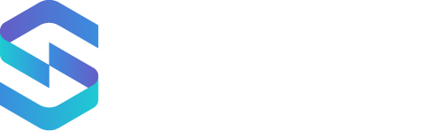

<h1 align="center">
   
  
</h1>

<h4 align="center">Enterprise-grade SIEM and XDR powered by Real-Time correlation and Threat Intelligence</h4>

## Introduction

Welcome to the UTMStack open-source project! UTMStack is a unified threat management platform that merges SIEM (Security Information and Event Management) and XDR (Extended Detection and Response) technologies. Our unique approach allows real-time correlation of log data, threat intelligence, and malware activity patterns from multiple sources, enabling the identification and halting of complex threats that use stealthy techniques.

We have a [dedicated repository](https://github.com/AtlasInsideCorp/UTMStackCorrelationRules)  for correlation rules, contributors are welcome to submit a pull request. 

## Features

- Log Management and Correlation
- Threat Detection and Response
- Threat Intelligence
- Alert Investigation
- File Classification
- SOC AI-Powered Analysis
- Security Compliance

## Why UTMStack?

UTMStack stands out in threat prevention by surpassing the boundaries of traditional systems. Our software platform can swiftly analyze log data to identify and halt threats at their source in real-time, even if the threat was not directly detected on the server itself. This seamless integration of SIEM and XDR capabilities sets UTMStack apart from competitors, providing organizations with an effective, holistic cybersecurity suite that enhances threat detection, response, and remediation across clients’ valuable digital infrastructure. Correlation happens before data ingestion, reducing workload and improving response times.

## Getting Started

To get started with UTMStack, visit our demo at utmstack.com/demo. You can also watch our videos to learn more about our platform:

- [Advanced Persistent Threats](https://www.youtube.com/watch?v=Rqbl65cJMuA)
- [UTMStack Features Overview](https://www.youtube.com/watch?v=lKkydWFiu4Y)

## Contributing

We welcome contributions from the community! Whether you're a developer, a security expert, or just someone interested in cybersecurity, your contributions can help make UTMStack even better. Check out our [Contributing Guide](CONTRIBUTING.md) for more information on how you can contribute to this project.

## Security

UTMStack is designed with security in mind. Every instance of UTMStack gets a dedicated Virtual Machine, protected by two firewalls for additional isolation from the internet and other tenants. All data at rest and in transit is encrypted, and server keys are stored in a KeyVault and can only be accessed by the Cloud Operations Engineering team for support and maintenance reasons.

## License

UTMStack is open-source software licensed under the AGPL. For more information, see the [LICENSE](LICENSE) file.

## Contact

If you have any questions or suggestions, feel free to open an issue or submit a pull request. We're always happy to hear from our community!

Join us in making UTMStack the best it can be!

# Installation

## Recommendations

### Operating System

This installation guide provides instructions to perform the UTMStack installation on Ubuntu 22.04 LTS.

### SYSTEM RESOURCES
Assumptions: 60 data sources (devices) generate approximately 100 GB of monthly data.

Definitions:
- Hot log storage: not archived data that can be accessed for analysis at any time.
- Cold storage: archived data that should be restored before accessing it.
- Data source: any individual source of logs, for example, devices, agents, SaaS integrations.

Resources needed for one month of hot log storage.
- For 50 data sources (100 GB) of hot log storage you will need 4 Cores, 8 GB RAM, 150 GB Disk Space
- For 120 data sources (250 GB) of hot log storage you will need 8 Cores, 16 GB RAM, 250 GB Disk Space
- For 240 data sources (500 GB) of hot log storage you will need 16 Cores, 32 GB RAM, 450 GB Disk Space
- You may combine these tiers to allocate resources based on the number of devices and desired hot log storage retention

## Installation steps

### Preparing for installation

- Update packages list: `sudo apt update`
- Install WGET: `sudo apt install wget`
- Download the latest version of the installer by typing `wget http://github.com/AtlasInsideCorp/UTMStackInstaller/releases/latest/download/installer`
- Change to root user: `sudo su`
- Set execution permissions with `chmod +x installer`

### Running installation

- Execute the installer without parameters: `./installer`

Once UTMStack is installed, use admin as the user and the password generated during the installation for the default user to login. You can found the password and other generated configurations in /root/utmstack.yml
Note: Use HTTPS in front of your server name or IP to access the login page.

### Required ports
- 22/TCP Secure Shell (We recommend to create a firewall rule to allow it only from admin workstation)
- 80/TCP UTMStack Web-based Graphical User Interface Redirector (We recommend to create a firewall rule to allow it only from admin and security analyst workstations)
- 443/TCP UTMStack Web-based Graphical User Interface (We recommend to create a firewall rule to allow it only from admin and security analyst workstations)
- 9090/TCP Cockpit Web-based Graphical Interface for Servers (We recommend to create a firewall rule to allow it only from admin workstation)
- Others ports will be required during the configuration of UTMStack's integrations in order to receive logs. (Please follow the security recommendations given on the integration guide if exists)
